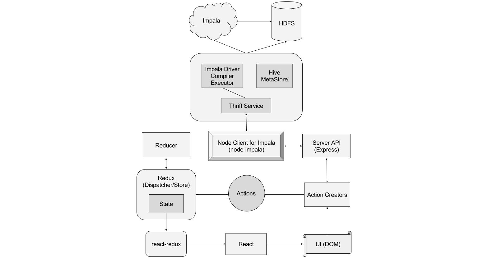

# Bloomery

Bloomery is an open source query execution tool for [Impala](http://impala.io/). It uses [node-impala](https://github.com/ufukomer/node-impala) which provides communication between Impala and Node client using the Beeswax Service. Bloomery has ability to show tables of database, columns of tables, saved queries, recent queries and so on.

* [Features](#features)
* [Architecture](#architecture)
* [Requirements](#requirements)
* [Installation](#installation)


## Features

Bloomery has the following features:

* _Syntax highlighting:_ On the web ui, the editor immediately highlights the sql keywords (e.g select, from, as, where, group, etc.) after the user types it.
* _Autocomplete:_ While user typing any of the sql keywords, the editor’s suggestion dropdown pops up.
* _Saved queries:_ It is possible to save any query using save query section.
* _Query history:_ Application saves the all recent queries.
* _Show query results:_ Shows all results under the results tab.
* _Remote connection:_ User can change connection settings for the purpose of connecting server from different machine either with different Host IP or Port Number.
* _Show tables:_ On top left side of the application it shows all tables of database.
* _Show columns:_ On the bottom left side of the application it shows table columns with their type property.

## Architecture

Bloomery communicates with node-impala using Express Rest API. Express Rest API maps URLs with node-impala’s connect and query methods. Then the actions like _executeQuery_, _showTables_, _showColumns_ sends query with request parameters to Rest API then Express forwards that query to node-impala which handles and returns results using Thrift. Eventually, Express puts this results to response body which we present to users inside the table under results tab of ui menu.



## Requirements

* Node.js
* Impala

## Installation

1. Install dependencies 

  ```
  $ npm install
  ```

2. Build Bloomery

  ```
  $ npm run build
  ```

3. Start server

  ```
  $ npm run serve
  ```

## License

Apache License, Version 2.0
